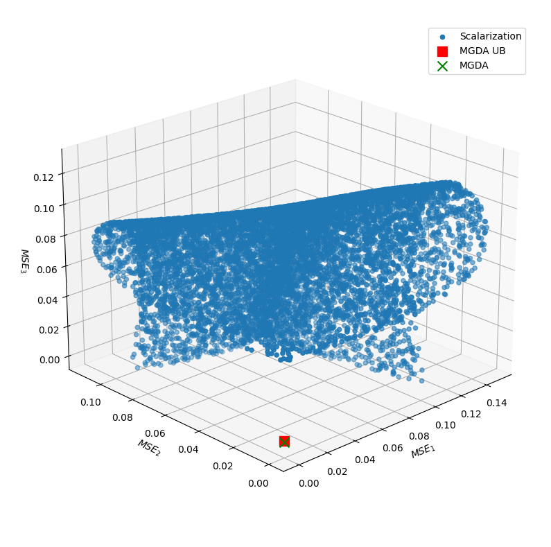
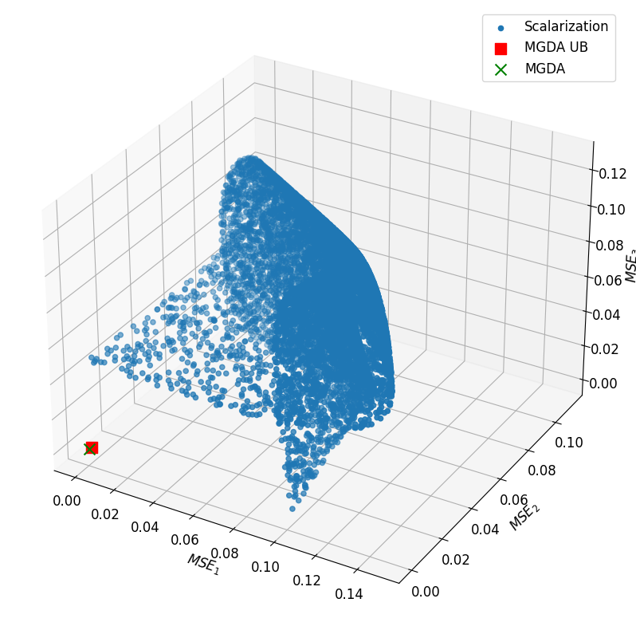

# Revisiting-Scalarization-in-MTL
This repository reproduces the results presented in the Neurips 2023 Poster [Revisiting Scalarization in Multi-Task Learning: A Theoretical Perspective](https://arxiv.org/abs/2308.13985.)

The code performs linear scalarization and MGDA/MGDA-UB on 3 tasks from the SARCOS dataset, as described in the paper.

Our code is divided into two sections: Scalarization and MultiObjectiveOptimization

## Scalarization
This code runs 10,000 MTL optimizations using linear scalarization at random scale parameters.

Using the following command to run this simulations:

```
python mtl_scalarization.py
```
## MultiObjectiveOptimization
This repository is forked and modified from [MultiObjectiveOptimization](https://github.com/isl-org/MultiObjectiveOptimization).
The changes include some updates for the code to run on more recent versions of numpy and torch and the additional integration of the Sarcos dataset

Use the following command in this directory to run MGDA

```
python multi_task/train_multi_task.py --param_file=./sarcos.json
```

To change between mgda and mgda-ub change the use_approximation in sarcos.json: 
* "use_approximation": true => mgda-ub 
* "use_approximation": false => mgda

## Visualizing the Results:

To view the outputs you can follow the final_plots.ipynb notebook. 
You will need to manually adjust the final losses from the MGDA and MGDA_UB algorithm. 
You can use the resulting .npy file from the mtl_scalarization.py command to load the 10,000 x 3 scalarization final losses.

The resulting visualization should look something similar as below:





We can observe that linear scalarization explores results around the outside of these feasible regions, whereas the Specialized Multi-Task Optimizers (MGDA and MGDA-UB) are able to achieve better, more balanced results within the intersection of these regions.
